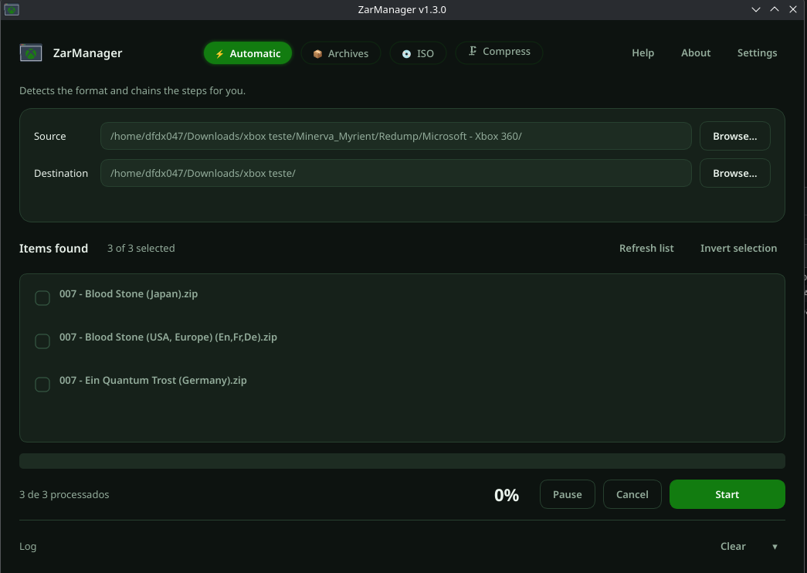
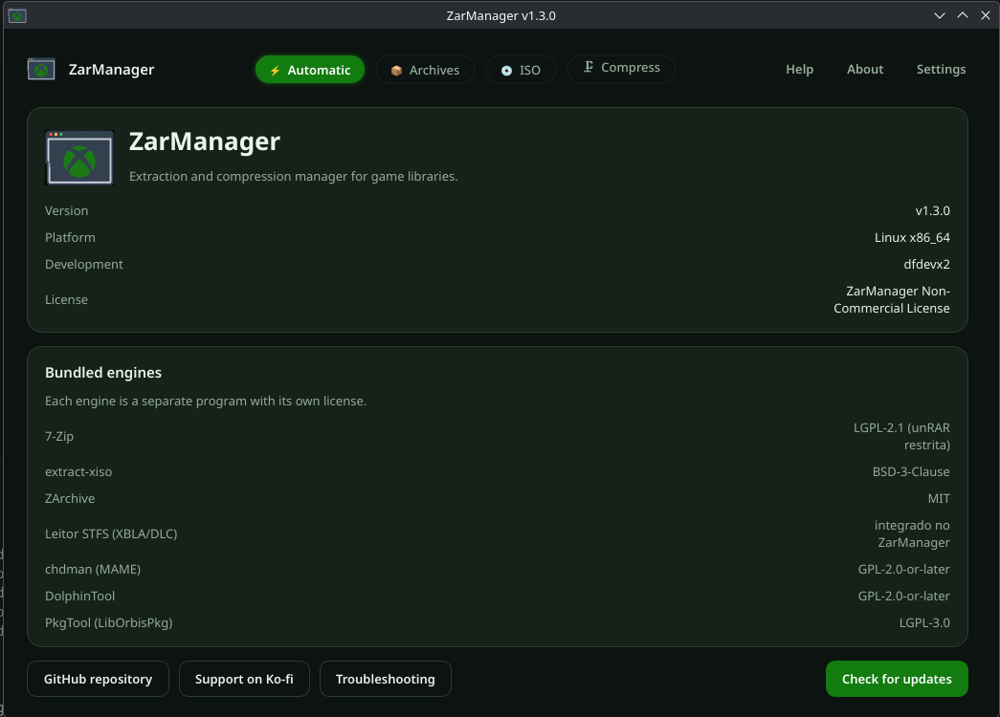
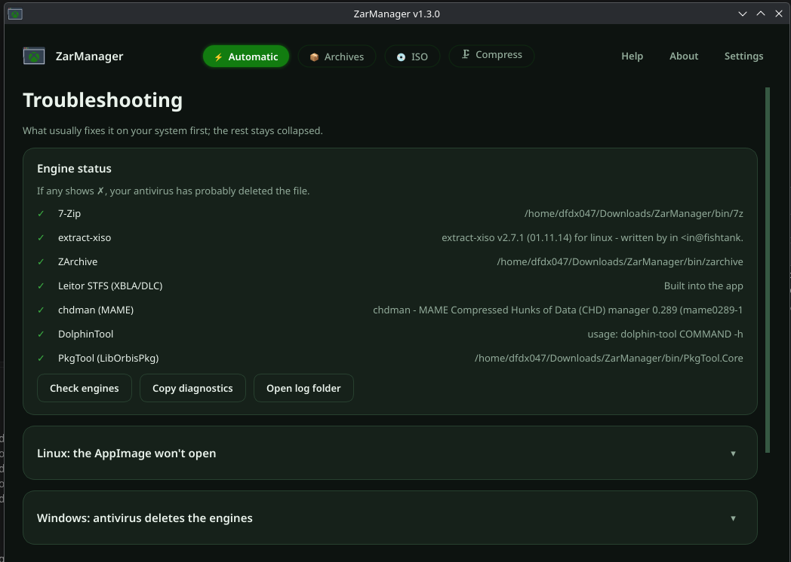
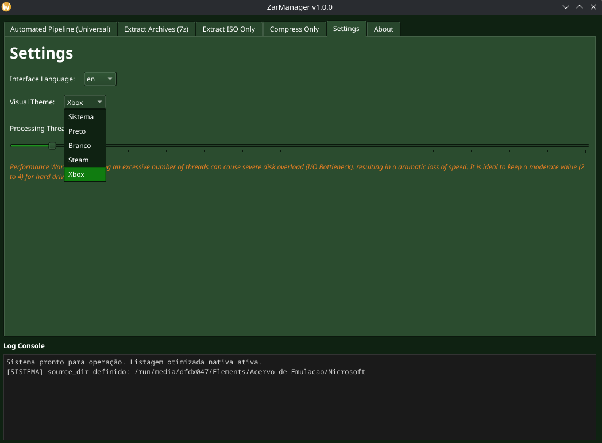

<p align="center">
  
</p>

<p align="center">
  <a href="https://github.com/dfdevx2/ZarManager/releases"></a>
  <a href="https://www.python.org/"></a>
  <a href="https://doc.qt.io/qtforpython-6/"></a>
  <a href="https://ko-fi.com/dfdx047"></a>
</p>

# ZarManager

ZarManager is a robust, cross-platform graphical utility designed to automate the heavy lifting of XISO extraction and batch compression into highly optimized `.zar` archives. By wrapping powerful command-line backend tools into a sleek, asynchronous interface, it completely streamlines retro game archiving and storage management.

## 📸 Interface & Features

<p align="center">
  
  
</p>
<p align="center">
  
  
</p>

## 🚀 Key Features

* **Automated Smart Pipeline:** Point it to a directory and ZarManager will identify `.zip`, `.rar`, `.7z`, and `.iso` files, sequentially run unzipping, XISO extraction, and `.zar` compression, cleaning up temporary residue automatically.
* **Multi-Threaded Engine:** Features dynamic thread clamping. It uses native background concurrency (`QThread`) to process batches parallelly without freezing the UI, maximizing your HDD/SSD I/O efficiency while preventing "ghost processes".
* **Data Safety & Integrity:** Automatic handling of file collisions with granular user prompts to *Overwrite*, *Skip*, or *Keep* original files after successful generation.
* **Dynamic Customization:** Switch between multiple visual themes (Pitch Black, White, Steam, Xbox) and localization languages (English, PT-BR) on the fly, with native macOS styling support.
* **First-Boot Guidance:** Incorporates an overlay tutorial and seamless hover balloon-tips across the UI to ensure any user understands complex processing options effortlessly.

## 🛠️ Core Technologies & Credits

ZarManager acts as a smart workflow wrapper for some of the best open-source archival engines available. The core operations rely on:
* **[extract-xiso](https://github.com/XboxDev/extract-xiso):** The premier utility by *XboxDev* for creating and extracting Xbox XDVDFS ISO images.
* **[zarchive](https://github.com/vasi/zarchive):** The revolutionary compression format designed by *Vasi*, allowing for real-time seekable compressed data.
* **[7-Zip](https://www.7-zip.org/):** The industry standard for robust file archiving.
* **[PySide6](https://doc.qt.io/qtforpython-6/):** The official Python module from the *Qt for Python* project providing the native interface.

> 🤖 **AI-Assisted Development:** The codebase concurrency, PySide6 thread synchronization, error handling logic, and robust Nuitka cross-OS packaging pipelines were rigorously debugged, refined, and documented with the assistance of Artificial Intelligence.

## 🩺 Troubleshooting & Common Errors

If ZarManager fails to process items, it will trigger an automated environment scan. Here are the most common OS-specific issues and their immediate fixes:

### 🪟 Windows
* **Error:** Processing stops instantly and logs `[CRITICAL ERROR] Missing Engines`.
* **Cause:** Since ZarManager is packed as a single `.exe` file, it extracts its background engines to `%TEMP%` at runtime. **Windows Defender** (or other AVs) frequently misinterprets this and silently deletes the tools as a False Positive.
* **Fix:** Add the `ZarManager.exe` file to your Antivirus **Exclusions** list and restart the app.

### 🍏 macOS
* **Error:** macOS says *"App is damaged and can't be opened"* or the background tools fail.
* **Cause:** Apple's *Gatekeeper* quarantines applications downloaded from the internet that lack expensive Apple Developer certificates.
* **Fix:** Open the macOS `Terminal` and run the following command to remove the quarantine flag: 
  ```bash
  xattr -cr /Applications/ZarManager.app
  ```

### 🐧 Linux
* **Error:** The `.AppImage` refuses to launch or silently fails during extraction.
* **Cause:** Missing execution permissions or missing AppImage base libraries.
* **Fix:** Right-click the `.AppImage` file > **Properties** > Enable **"Allow executing file as program"**. Also, make sure you have `libfuse2` installed on your distribution (e.g., `sudo apt install libfuse2`).

## ⚙️ Compilation (Build from Source)

The project uses Nuitka to compile standalone native binaries. To compile the application yourself:

1. Clone the repository and setup the Python environment:
    ```bash
    git clone [https://github.com/dfdevx2/ZarManager.git](https://github.com/dfdevx2/ZarManager.git)
    cd ZarManager
    python -m venv venv
    source venv/bin/activate  # On Windows: venv\Scripts\activate
    pip install -r requirements.txt
    ```
2. Build with Nuitka (adjust parameters per OS):
    ```bash
    python -m nuitka --onefile --enable-plugin=pyside6 --include-data-dir=bin=bin --output-dir=dist app.py
    ```

## 📜 License

This project is licensed under the MIT License. See the `LICENSE` file for details.